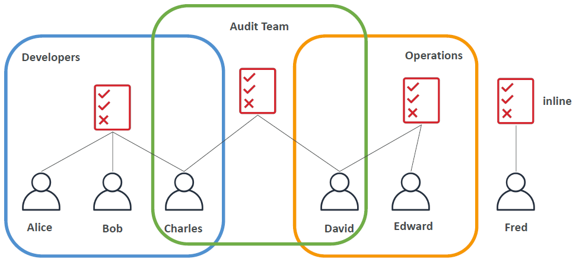
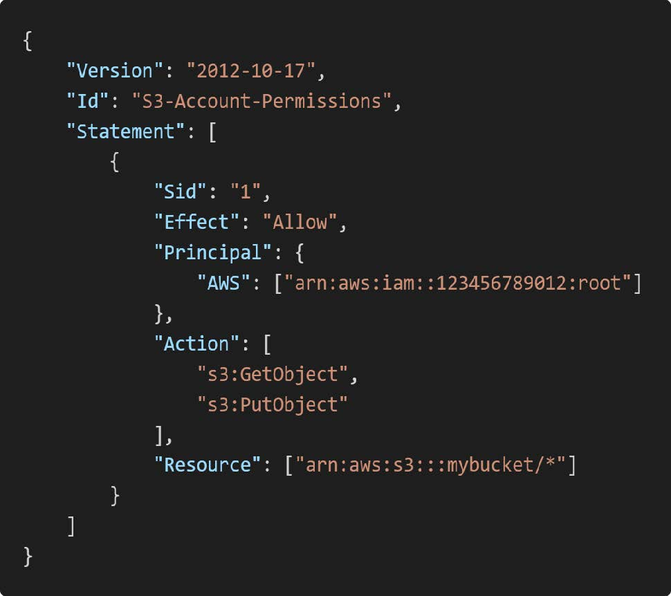

# IAM 소개와 정책

## IAM 사용자
> * IAM 은 루트 계정과 IAM 으로 나뉜다.
> * 루트 계정을 그대로 사용하면 보안상 문제가 생길 수 있기에 사용 권한을 나눠 IAM 이라는 형태의 계정을 지급하여 사용한다.
> * IAM 사용자 및 그룹에게 어떠한 권한을 부여할 수 있으며 IAM 정책은 그러한 권한을 지칭하는 용어이다.

위의 그림은 IAM 사용자들의 그룹과 사용자 권한을 나타내는 예시이다. 위의 그림과 같이 그룹을 형성해 그룹에 정책과 권한을 부여할 수 있고, 그룹에 포함된 사용자들은 그 권한들을 상속받는다.

또한 하나의 사용자는 여러개의 그룹에 속할 수 있다. 물론 그룹에 속하지 않더라도 권한을 부여하는 것이 가능하다.

단, 그룹 안에 다른 그룹이 존재하는 중첩그룹의 형태는 지원하지 않는다.

## IAM 정책 파일
> Json 파일의 형태로 정책의 구성 요소들을 표현하고 저장 가능하다.

위의 그림은 Json 파일로 구성된 정책 파일의 예시이다. 주요 구성 요소들은 아래와 같다.

* Version: 정책 언어의 버전
* Id: 정책을 식별하는 고유 ID, 선택 사항이다.
* Statement: 하나 이상의 권한 규칙을 포함하는 정책의 핵심 내용
* Effect: 권한의 효과를 지정, 허용시 Allow, 거부시 Deny 로 표현
* Principal: 권한이 부여될 주체(사용자, 계정, 서비스 등)를 지정
* Action: 권한이 부여될 작업의 종류
* Resource: 권한이 적용될 리소스의 ARN(Amazon Resource Name)을 지정 

IAM 정책은 기존에 정의된 정책들을 부여하는 방법도 있고, 자신만의 정책을 생성해서 부여하는 방법도 가능하다.