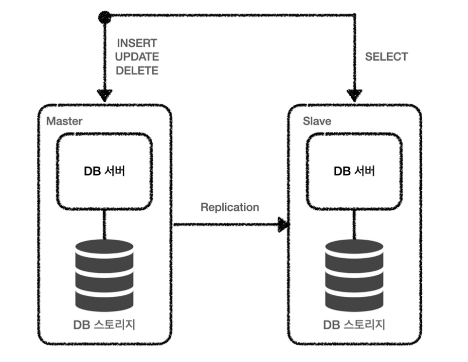

# 조회 성능 개선 방안
> 인덱스 이외에 DB 에서 성능을 끌어올릴 만한 방안들을 정리한 문서입니다.

---
## 미리 집계
> 말 그대로 조회할만한 내용들을 미리 집계하는 방식이다.
> 데이터 요청 시 보여줄 데이터를 집계하는 것이 아니라 미리 집계해서 저장해놓고 꺼내다 쓰는 방식

실제로 개발을 진행할 때 해당 방식을 이용해서 Spring Batch 를 이용해 미리 집계해놓고 꺼내다 쓰는 방식을 사용했었다.
이 때 100 만 건의 데이터에 대해서 수 십배 이상의 효과를 얻어낼 수 있었다.

---
## 페이지 기준 목록 조회 vs ID 기준 목록 조회
> 페이지 기준 목록 조회는 앞에서 부터 모든 데이터를 조회해야 하므로 성능면에서 떨어질 수 있다.
> 해당 문제를 해결하기 위해 특정 ID 를 기준으로 조회하는 방식을 고려 가능하다.

1 만개의 데이터를 가진 테이블이 있다고 가정했을 때 페이지 기준으로 목록을 조회하는 쿼리는 다음과 같다.
```SQL
SELECT id, title
FROM post
ORDER BY id desc
LIMIT 10 offset 0;
```
위와 같이 앞 부분 10개의 데이터를 불러올 때는 상관이 없게 보일 수 있으나 다음과 같은 코드에서 문제가 발생한다.
```SQL
SELECT id, title
FROM post
ORDER BY id desc
LIMIT 10 offset 9990;
```
이 쿼리 실행시 앞의 9990 개를 모두 세고 나서 10개 데이터를 조회하게 된다. 따라서 9990 개를 불필요하게 세는 시간이 낭비된다.
조건문이 들어가기라도 한다면 앞의 9990 개의 모든 데이터의 조건을 확인하는 과정이 필요하게 된다.

따라서 아래와 같이 id 를 기준으로 쿼리를 개선하는 것이 가능하다.

```SQL
SELECT * from post
WHERE
ORDER BY id desc
LIMIT 10 offset 9990;
```
위와 같이 지정된 오프셋 값만큼 세는 시간을 절약할 수 있다.

---
## 조회 범위를 시간 기준으로 제한
> 조회 범위를 시간 기준으로 제한하면 페이지 기준이나 ID 기준에 비해 코드가 간단해진다.
> 보통 데이터는 최신 데이터를 자주 불러오므로 최신 데이터 기준 조회 방식은 캐시 효율을 극대화하는 방식이다.
---
## 전체 데이터 세는건 안돼요
> 목록 표시 시 전체 데이터가 몇 개인지 보여주는 경우 미리 count 를 집계하지 않는 경우 심각한 성능 문제가 발생 가능하다.
> 전체 데이터를 직접 세는 과정이 필요하기 때문
---

## 오래된 데이터 삭제, 분리보관
> 데이터가 늘어날수록 쿼리 실행 시간이 증가하므로 적절히 삭제하거나 분리해서 보관할 필요가 있다.

---
## DB 장비 확장
> DB 장비를 수직 확장 하는 것은 서비스를 가능한 상태로 만들어 시간을 벌 수 있는 방법이다. (단, 돈이 든다...)
> 조회 트래픽이 많은 경우 별도의 복제 서버를 만들어 조회 기능만 하도록 만들 수 있다.

아래 사진은 주 DB - 복제 DB 구조 그림이다. 그림과 같이 메인 서버에서는 추가, 삭제, 수정 등의 작업을 진행하고,
복제 서버에서 조회 관련 작업을 담당하게 된다.


단, DB 서버는 보통 성능이 API 서버보다 훨씬 좋으므로 비용이 만만치 않을 수 있다..

---
## 별도 캐시 서버 구성
> DB 만으로 트래픽을 처리하기 힘들 수 있으므로 REDIS 와 같은 캐시서버를 고려할 만 하다.
