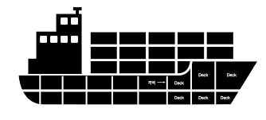

# 벌크 헤드 (학습 진행중)
> * 선박이나 선체의 격벽(Bulkhead)
> * 선박은 완전히 분리된 여러개의 데크로 구성되는데 이를 격리하는 벽을 격벽이라고 부른다.
> * 이러한 구조는 선박의 외상이 다른 데크로 전파되는 것을 예방한다.

## 벌크 헤드 패턴
> 하나의 컴포넌트에 문제가 생기더라도 다른 컴포넌트에 장애가 전파되지 않도록 리소스를 분리하는 패턴

아래의 그림을 예시로 들어 설명해 보겠다.

위 그림의 첫번째에는 서비스 A 가 가진 스레드 풀이 분리되지 않아 B 서비스와 C 서비스가 동시에 이용이 가능하다.
가령 B 서비스에서 스레드풀의 스레드를 모두 사용한다면 C 서비스는 스레드를 사용하지 못해 장애가 발생한다.
하지만 벌크헤드 패턴 적용 후의 그림처럼 각 서비스 별로 리소스(그림에서는 스레드 풀)를 분리한다면 B 서비스에서 사용가능한 스레드를 모두 사용해도
C 서비스는 할당된 스레드풀의 스레드를 활용하면 되므로 C 서비스에는 장애가 생기지 않는다.