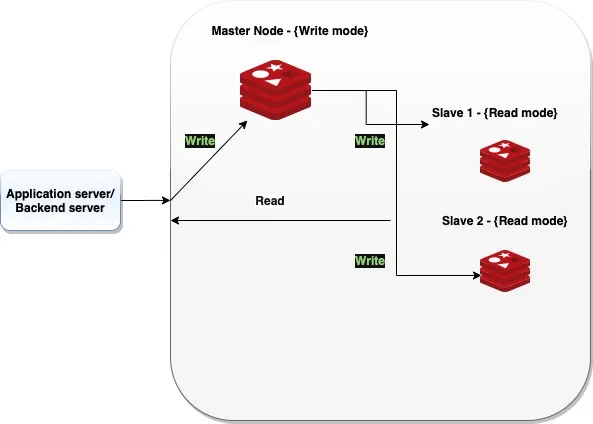
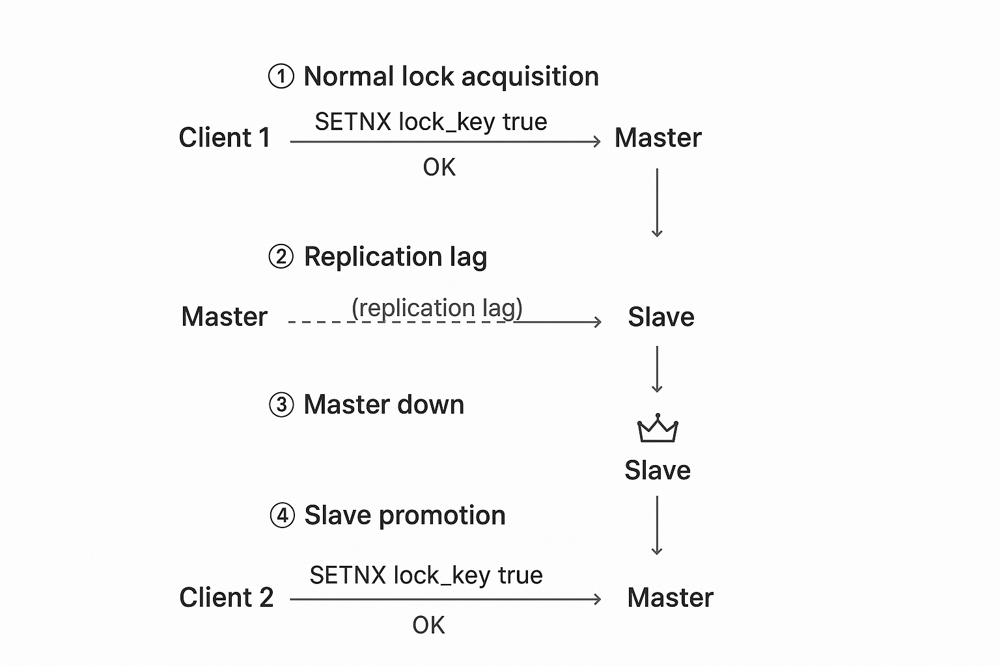
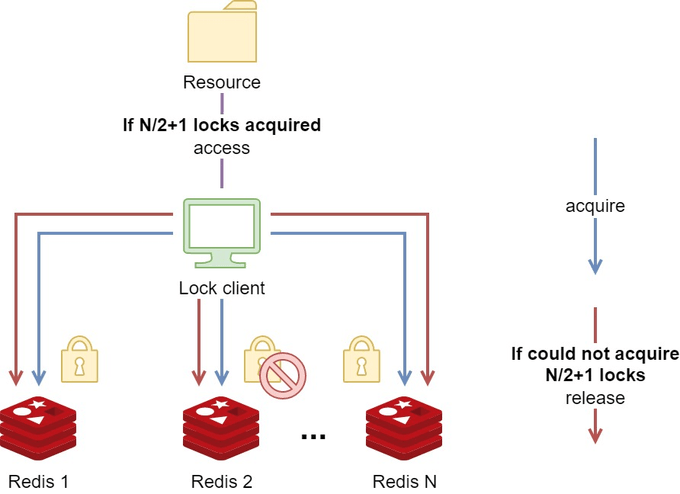

# RedLock

## Redis 장애 대응
> Redis 는 일반적으로 여러 서버로 이루어진 환경에서 서로 다른 클라이언트의 공유 자원을 관리하기 위해 사용되곤 한다. 
> 
> 이 때문에 같은 자원에 접근 시 동시성 이슈가 발생할 수 있을 것 같지만, 단일 스레드로 동작하기 때문에 하나의 Redis 서버로 운영하더라도 동시성 이슈로부터는 자유롭다.
> 
> 하지만 단일 서버로 운영되는 Redis 노드는 단일 장애 지점(SPOF)이 될 수 있으므로 추가적인 보완 설계가 필요하다.

## Master-Slave 방식
> 위의 한계점을 해결하기 위해서 고안된 방식으로 말 그대로 `Master`와 `Slave`로 이루어진 서버를 구성하는 방식이다.

기본적으로 위와 같이 하나의 `Master`노드에 N개의 `Slave`노드로 구성된다.

일반적으로 `Master`노드가 쓰기를 담당하고 실시간으로 데이터를 복제한 `Slave`가 읽기를 담당한다.

`Slave` 노드는 `Master`노드를 복제해 두었다가 `Master`노드에 장애가 발생하면 `Slave`노드가 `Master`노드로 승격하여 서비스를 유지하는 구조이다.

하지만 Redis 의 복제가 비동기 방식이기 때문에 한계점이 존재한다. 

### Master-Slave 방식의 한계점
하나의 시나리오 예시를 위해서 `A`라는 `Master`노드와 `B`라는 `Slave`노드를 가정해보겠다.

1. `클라이언트 1`이 `A`에 `SET...NX` 명령을 보내 락을 획득한다.
2. `A`가 이 락 정보를 `B`에게 복제하기 전, `A`에 장애가 발생한다.
3. Redis 클러스터가 `B`를 새로운 `Master`로 승격시킨다.
4. `클라이언트 2`가 새롭게 `Master`가 된 `B`에게 락을 요청한다.

결과적으로 `A`와 `B` 모두 쓰기를 할 수 있는 락을 획득하게 되어, 분산 락이 깨지게 되며 데이터가 꼬이는 `Split-Brain`이 발생한다.

### RedLock
위와 같은 문제를 해결하기 위해서 Redis의 창시자(Antirez)가 제안한 방안이 RedLock 알고리즘이다.

RedLock 방식은 핵심 아이디어로 `Quorum` 방식을 사용한다. 

`쿼럼(Quorum)` 방식은 컴퓨터 클러스터와 같은 분산 시스템에서 시스템이 과반수(majority) 이상의 노드로 구성되어 있을 때,
안정적인 의사 결정을 내리고 작업을 수행할 수 있도록 하는 메커니즘이다.

`RedLock` 을 아래의 시나리오와 함께 알아보겠다.

### RedLock 알고리즘 시나리오

서로 완전히 독립적인 Redis 마스터 노드 5개를 준비한다. (이 때 `Slave`도 없으며 노드 간 복제도 하지 않는다.)

1. `클라이언트 1`이 5개의 모든 마스터 노드에게 동시에 `SET...NX`라는 락 획득 요청을 보낸다. (각각 짧은 타임아웃 적용)
2. 과반수(Majority), 즉 5개 중 3개 (N/2 + 1) 이상의 노드로부터 "OK" 응답을 받으면, 클라이언트는 락을 획득하는데 성공했다고 간주한다.
3. 만약 "OK" 응답이 3개 미만이거나, 과반수를 얻었더라도 그 과정이 너무 오래 걸렸다면(전체 락 유효시간을 초과), 락 획득 실패로 간주한다.
4. 락 해제에 실패했다면, 혹시라도 1~2개 노드에 설정됐을지 모르는 락을 모두 해제(DEL)해야 한다.

### RedLock 알고리즘 정리
1. 시작 시간(T1) 기록: 락 획득에 얼마나 걸렸는지 측정하기 위해 현재 시간을 `ms` 단위로 저장한다.
2. 모든 노드에 락 요청: N개의 모든 `Master` 노드에 `SETNX` (없으면 생성) 명령을 보낸다.
   * 랜덤 값 : 락을 해제할 때 `내가 락을 건 게 맞는지` 확인하기 위해 랜덤 값을 사용한다.
   * 짧은 타임아웃 : 특정 노드가 죽었을 때 오래 기다리지 않고(예시-50ms) 즉시 다음 노드로 넘어간다.
3. 종료 시간(T2) 기록: 마지막 노드까지 락 요청을 시도한 후 현재 시간을 저장한다.
4. 과반수(N/2 + 1) 성공 확인: 5대 중 3대처럼, 과반수 이상의 노드로부터 OK 사인을 받았는지 확인한다.
   * 성공 시 : 5번으로 이동.
   * 실패 시 : 락 획득에 실패했으므로, OK 사인을 보냈던 모든 노드에 락 해제(DEL) 명령을 보낸다.
5. 실제 락 유효 시간 계산
   * `실제 유효 시간` = `원래 설정한 TTL` - `(T2 - T1)`
   * `(T2 - T1)`은 락을 얻는 데 걸린 시간이다. 이 시간만큼을 뺀 남은 시간 동안만 임계 영역(Critical Section) 작업을 수행하며, 작업이 끝나면 락을 해제한다.

#### Clock Drift 문제
RedLock 알고리즘에서 로컬 시계가 실제 시간과 불일치해서 발생하는 문제이다.

이 부분은 추후 정리하도록 하겠다..

### 참고 자료 및 이미지 출처
[Redis Master-Slave Configuration and Tested in Spring Boot](https://faun.pub/redis-master-slave-configuration-and-tested-in-spring-boot-3a68e7314b90) 
[Implement Distributed Lock For a Microservices Software System](https://careers.saigontechnology.com/blog-detail/implement-distributed-lock-for-a-microservices-software-system)
[Redlock 알고리즘 알아보기](https://hudi.blog/redlock-algorithm/)