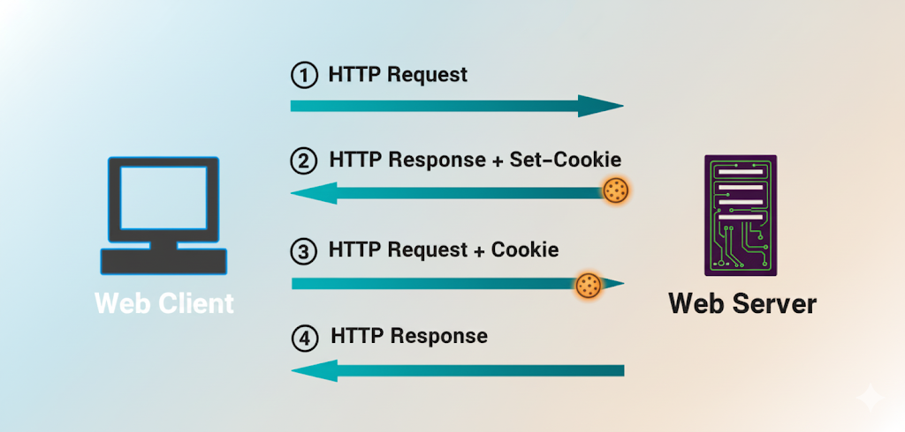

# 인증 & 인가

## 인증
> 장치 또는 사용자를 식별하는 행위. 예를 들어 우리가 로그인을 하는 행위는 인증에 해당한다. IAM ROLE이 인증에 해당한다고 보면 될 것 같다.

## 인가
> 장치나 사용자 엑세스 권한을 허용하거나 거부하는 행위(엑세스 권한 확인 프로세스). IAM 정책이 인가에 해당한다고 보면 될 것 같다.

정리하자면 인증은 사용자 등이 누구인지, 인가는 그 사용자가 무엇을 할 수 있는지에 집중되어 있다고 보면 되겠다. 이러한 구조 때문에 보통의
시나리오에서는 인증이 인가보다 앞서 수행되는 것이 일반적이다.

## 인증과 인가의 구현 방법

### 인증과 인가가 필요한 이유
> 구현 방법에 대해 알아보기 전 왜 세션, 쿠키, jwt 등 다양한 방식으로 인증과 인가를 구현하는지를 알아보자.

결론부터 말하면 HTTP 때문이다. 서버와 클라이언트의 데이터를 주고받기위해 주로 HTTP를 사용하는데 HTTP 는 stateless 하다는 특징이 있다.

때문에 각 요청은 완전히 독립적이고, 서버는 방금 전의 요청과 지금의 요청이 같은 사용자에게서 온 것인지 기억하지 못한다.

때문에 상태 유지가 어려운 HTTP 의 한계를 극복하고자 쿠키, 세션, 토큰 등의 방식이 활용되는 것이다.

---

## Cookie

### 쿠키(Cookie)란
>쿠키는 서버와 클라이언트(브라우저)가 상태를 유지하기 위해 주고받는 작은 데이터 조각

### 쿠키 동작 원리

* #### 서버 → 클라이언트
서버가 응답 헤더에 **Set-Cookie**를 포함시켜, 클라이언트에게 특정 정보(이름-값 쌍)를 저장하라고 지시

이때 **Set-Cookie** 의 형식은 아래의 형식을 따른다.

```HTTP
Set-Cookie: <cookie-name>=<cookie-value>
```

아래는 실제 Set-Cookie HTTP 응답 헤더 형식을 예시로 작성한 것이다.

```HTTP
HTTP/1.0 200 OK
Content-type: text/html
Set-Cookie: cookie1=juni
Set-Cookie: cookie2=karp
```

* #### 클라이언트 → 서버
클라이언트는 한번 저장한 쿠키를, 다음 요청부터 Cookie 헤더에 담아 자동으로 서버에 전송 (쿠키를 통해 사용자 식별)

```http
GET /sample_page.html HTTP/1.1
Host: www.example.org
Cookie: cookie1=juni; cookie2=karp
```
위의 예시와 같이 Cookie 헤더를 사용해 이전에 저장해 둔 쿠키들을 응답과 함께 보낸다.



전체 동작 순서는 위 그림과 같다.

### 쿠키의 종류

#### 수명에 따른 구분

* #### 세션 쿠키 (Session Cookie)
  * 세션 쿠키는 사용자가 브라우저를 닫으면 삭제되는 임시 쿠키
  * `Expires`나 `Max-Age` 같은 만료 시간 속성이 없음
  * 브라우저의 메모리에 저장
* #### 지속 쿠키 (Persistent Cookie)
  * 지속 쿠키는 지정된 만료 날짜나 시간까지 사용자의 컴퓨터에 남아있는 쿠키
  * `Expires`나 `Max-Age` 같은 만료 시간 속성이 존재 (둘 다 존재시 `Max-Age` 기준으로 만료)
  * 사용자의 디스크에 저장

#### 도메인에 따른 구분

* #### 퍼스트 파티 쿠키 (First-Party Cookie)
  * 사용자가 방문하는 웹사이트의 도메인에서 생성되고 제어되는 쿠키
  * 웹사이트의 핵심 기능(로그인 유지, 언어 설정, 장바구니 등)을 위해 주로 사용
* #### 서드 파티 쿠키 (Third-Party Cookie)
  * 사용자가 방문한 웹사이트가 아닌, 외부의 다른 도메인에서 발행한 쿠키
  * 여러 웹사이트에 걸쳐 사용자의 행동을 추적하여 맞춤형 광고를 제공하거나, 방문 기록을 분석하는 데 주로 사용
  * 사용자 사생활 침해 등 부작용이 있어, 일부 브라우저에서는 차단 및 비활성화됨

### 쿠키 헤더 주요 속성

<table>
  <tr>
    <th>용도</th>
    <th>속성</th>
    <th>설명</th>
    <th>예시</th>
  </tr>
  <tr>
    <td rowspan="2">수명 제어</td>
    <td>Expires</td>
    <td>쿠키가 만료될 정확한 날짜와 시간을 지정</td>
    <td><code>Expires=Wed, 08 Oct 2025 07:28:00 GMT</code></td>
  </tr>
  <tr>
    <td>Max-Age</td>
    <td>쿠키가 유효한 시간을 초 단위로 지정 (Expires보다 우선 적용)</td>
    <td><code>Max-Age=3600</code></td>
  </tr>
  <tr>
    <td rowspan="2">범위 제어</td>
    <td>Domain</td>
    <td>쿠키가 전송될 도메인을 지정</td>
    <td><code>Domain=google.com</code></td>
  </tr>
  <tr>
    <td>Path</td>
    <td>쿠키가 전송될 서버 내 경로를 지정</td>
    <td><code>Path=/admin</code></td>
  </tr>
  <tr>
    <td rowspan="2">보안 제어</td>
    <td>Secure</td>
    <td>HTTPS 연결에서만 쿠키를 전송하도록 제어(세션 하이재킹 방지)</td>
    <td><code>Secure</code></td>
  </tr>
  <tr>
    <td>HttpOnly</td>
    <td>자바스크립트가 쿠키에 접근하는 것을 막음 (XSS 예방)</td>
    <td><code>HttpOnly</code></td>
  </tr>
  <tr>
    <td>CSRF 방어</td>
    <td>SameSite</td>
    <td>다른 도메인에서의 요청 시 쿠키 전송 정책을 결정</td>
    <td><code>SameSite=Strict</code> <code>SameSite=Lax</code> <code>SameSite=None</code></td>
  </tr>
</table>


### 참고
[MDN_HTTP_COOKIE](https://developer.mozilla.org/ko/docs/Web/HTTP/Guides/Cookies)<br>
[HTTP State Management Mechanism](https://datatracker.ietf.org/doc/html/rfc6265)