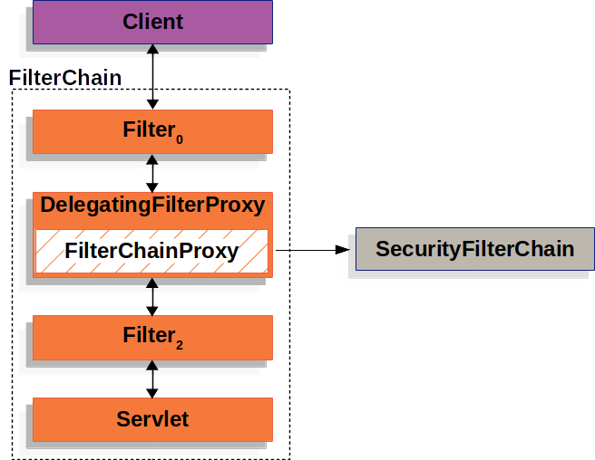
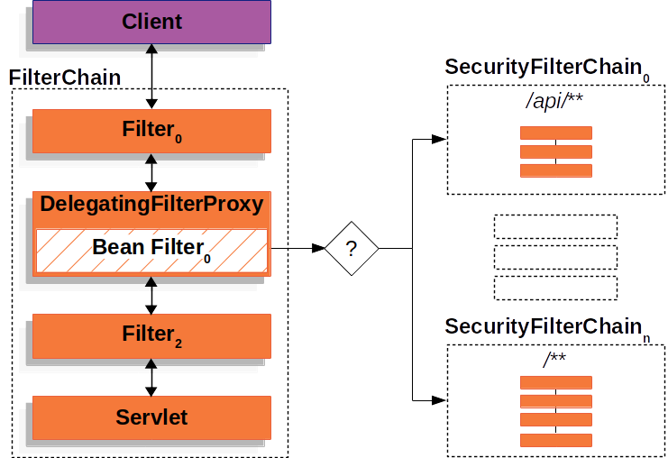

# 동작 원리

## 의존성이 없는 경우
* 클라이언트의 요청은 서버 컴퓨터의 was 를 통과한 후 스프링 컨테이너의 컨트롤러에 도달

## 의존성을 추가한다면
* WAS 의 필터단에서 사용자의 request 를 가로챈 뒤 감시 및 통제

### 동작 순서
1. WAS 의 필터에 하나의 필터를 만들어 넣으면 해당 필터에서 요청을 가로챈다.
2. 해당 요청은 스프링 컨테이너 내부의 스프링 시큐리티 감시 로직을 거친다.
3. 컨테이너 내부의 security 로직이 끝난 후 WAS 의 다음 필터로 복귀한다.

이 때 스프링 시큐리티 로직은 여러캐의 필터들이 나열된 필터 체인 형태로 각각의 필터가 로그아웃, 로그인, CSRF, 인가 등 여러가지 작업을 수행한다.

그림과 같이 여러 개의 필터 체인을 등록해서 사용이 가능하다.

### 주요 용어 정리
* DelegatingFilterProxy
    * 스프링 Bean 을 찾아서 요청을 넘겨주는 서블릿 필터
* FilterChainProxy
    * 스프링 시큐리티 의존성을 추가하면 DelegatingFilterProxy에 의해 호출되는 SecurityFilterChain 들을 들고있는 Bean
* SecurityFilterChain
    * 스프링 시큐리티 필터들의 묶음으로 실제 시큐리티 로직이 처리되는 부분
    * FilterChainProxy 가 SecurityFilterChain 들을 들고 있음