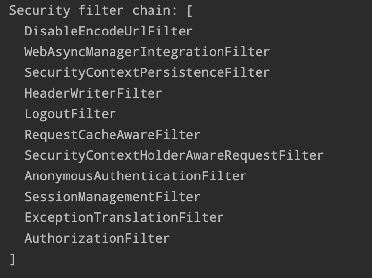

# SecurityFilterChain 구조

## SecurityFilterChain 란
> `SecurityFilterChain` 은 스프링 시큐리티의 보안, 인증, 인가 등의 주요 로직을 담당
> 하나의 `SecurityFilterChain` 내에 N개의 필터가 각각 하나의 로직 수행의 시작점이 된다.

## SecurityFilterChain 에 등록된 필터 확인
* `filterChainProxy` 의 break point 활용
    * `filterChainProxy` 클래스의 `getFilters()` 메서드를 break point 를 걸어서 debug 모드로 실행
* `@EnableWebSecurity` debug 모드 설정
```java
@Configuration
@EnableWebSecurity(debug = true)
public class SecurityConfig {
    
}
```
위와 같이 `@EnableWebSecurity` 어노테이션을 debug 모드로 설정하고 실행한 후 아무 경로로 요청을 보내면 터미널에 통과하는 `securityFilterChain` 의 필터 목록이 출력됨



## 스프링 시큐리티 제공 필터 간단 정리
* DisableEncodeUrlFilter
    * URL로 간주되지 않는 부분을 포함하지 않도록 설정
    * 세션 ID 등이 유출될 가능성 있으므로 URL에 포함되는 것을 막는 역할
* WebAsyncManagerIntegrationFilter
    * 비동기로 처리되는 작업에 대해 알맞은 `SecurityContext`를 적용
* SecurityContextPersistenceFilter
    * 사용자 인증에 대한 정보를 담고 있는 `SecurityContext` 를 가져오거나 저장하는 역할의 필터
* HeaderWriterFilter
    * 응답 Header에 spring security 관련 Header를 추가해 주는 필터
    * X-Frame-Options, X-XSS-Protection and X-Content-Type-Options 등
* CorsFilter
    * CORS 설정 필터
* CsrfFilter
    * CSRF 방어 필터
* LogoutFilter
    * 로그아웃 요청 처리 시작점 
    * 설정된 로그아웃 URL로 오는 요청을 확인해 로그아웃 처리하는 필터
* UsernamePasswordAuthenticationFilter
    * username/password 기반 로그인 처리 시작점 `POST:"/login"`
* DefaultLoginPageGeneratingFilter
    * 기본 로그인 페이지 생성 `GET:"/login"`
* DefaultLogoutPageGeneratingFilter
    * 기본 로그아웃 페이지 생성 `GET:"/logout"`
* BasicAuthenticationFilter
    * http basic 기반 로그인 처리 시작점
* RequestCacheAwareFilter
    * 로그인 성공 후, 관련 캐시 요청을 확인하고 캐시 요청을 처리하는 필터
    * 예) 로그인 하지 않고 방문했던 페이지 기억 후 로그인 후 해당 페이지로 이동 처리
* SecurityContextHolderAwareRequestFilter
    * ServletRequest 에 서블릿 API 보안을 구현
    * HttpServletRequest 정보를 감싸서 필터 체인 상의 다음 필터들에게 부가 정보 제공하기 위해 사용하는 필터
* AnonymousAuthenticationFilter
    * 필터 호출 시점까지 인증되지 않는 경우 `익명 사용자 전용 객체(AnonymousAuthentication)` 만들어서 `SecurityContext`에 넣어주는 필터
* SecurityContextHolderFilter
    * 접근한 유저에 대해 `SecurityContext` 관리 
* ExceptionTranslationFilter
    * 인증 및 접근 예외에 대한 처리 
    * 요청 처리 중 발생 가능한 예외를 위임 혹은 전달하는 필터
* SessionManagementFilter
    * 인증된 사용자 관련 세션 작업 진행
    * 유효하지 않은 세션에 대한 처리, 변조 방지 전략 등을 설정하는 작업을 처리하는 피렅
* AuthorizationFilter
    * `AuthorizationManager`를 사용하여 URL을 통해 사용자의 리소스 접근에 대한 액세스를 제한하는 인증 필터
    * 경로 및 권한 별 인가 처리 (구. filterSecurityInterceptor)

### SecurityFilterChain 에 필터 활성화/비활성화
* CORS 필터 설정
```java
http
        .cors((cors) -> cors.disable());
```

* CSRF 필터 설정
```java
http
        .csrf((csrf) -> csrf.disable());
```

* UsernamePasswordAuthenticationFilter 활성/비활성
```java
// 활성
http
        .formLogin(withDefualts());

// 비활성
http
        .formLogin((login) -> login.disable());
```
* 로그인/로그아웃 필터 활성/비활성
```java
// formLogin 메서드 설정시 기본적으로 활성화

// 커스텀 하면 기본 필터 비활성
http
        .formLogin((login) -> login.loginPage("/login").permitAll());
```

* BasicAuthenticationFilter 활성/비활성
```java
// 활성
http
        .httpBasic(withDefualts());

// 비활성
http
        .httpBasic((basic) -> basic.disable());
```

### SecurityFilterChain 에 커스텀 필터 등록
* 특정 필터의 이전에 등록
```java
http
        .addFilterBefore(추가할 필터, 기존 필터.class);
```
* 특정 필터 위치에 등록
```java
http
        .addFilterAt(추가할 필터, 기존 필터.class);
```
* 특정 필터의 이전에 등록
```java
http
        .addFilterAfter(추가할 필터, 기존 필터.class);
```

#### 참고 자료
* [스프링 필터 종류](https://developsd.tistory.com/138#google_vignette)