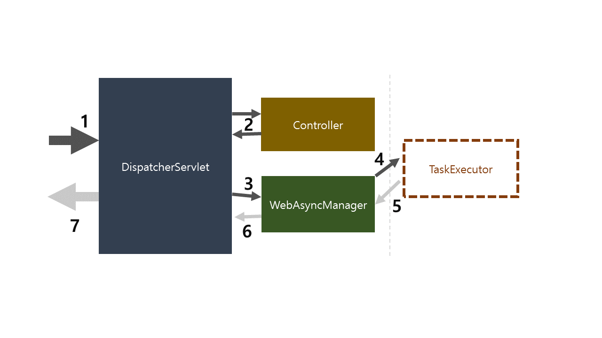

# WebAsyncManagerIntegrationFilter

## 사용 목적
> `WebAsyncManagerIntegrationFilter`은 `DefaultSecurityFilterChain`에 기본적으로 등록되는 필터로 두 번째에 위치한다.
> 
> 해당 필터는 서블릿 단에서 비동기 작업을 수행할 때 서블릿 입출력 스레드와 작업 스레드가 동일한 `SecurityContextHolder`의 `SecurityContext` 영역을 참조할 수 있도록 도와준다.

한마디로 `SecurityContextHolder`의 `ThreadLocal` 전략에 따라서 동일한 스레드에서만 `SecurityContext`에 접근 가능한데, 
비동기 방식에서는 하나의 작업을 여러 개의 스레드로 수행하므로 이 부분을 보완하기 위한 목적으로 사용된다.

커스텀으로 `SecurityFilterChain`을 생성하더라도 등록된다.

## Callable 사용 시 스레드
```java
@GetMapping("/async")
@ResponseBody
public Callable<String> asyncPage() {
    System.out.println("Start" + SecurityContextHolder.getContext().getAuthentication().getPrincipal());
    
    return () -> {
      Thread.sleep(5000);
      System.out.println("End" + SecurityContextHolder.getContext().getAuthentication().getPrincipal());
      
      return "async";
    };
}
```
해당 코드는 `Callable<>` 인터페이스로 감싼 아래 부분인 return 부분을 다른 스레드에서 수행한다.

하지만 서로 다른 스레드에서 작업을 수행하더라도 `ThreadLocal`로 관리되는 `SecurityContextHolder`의 값은 `WebAsyncManagerIntegrationFilter`와 여타 클래스들을 통해 동일하게
가져오는 것이 가능하다.

즉, 위 코드를 실행해보면 print 하는 부분에서 서로 다른 스레드를 사용하지만 동일한 값을 반환하는 것을 확인하는 것이 가능하다.

## 서블릿단에서 비동기 처리를 하는데 어떻게 필터단에서 미리 판단하고 처리할까?
이에 대한 답을 얻기 위해서는 `WebAsyncManagerIntegrationFilter`가 실제로 수행하는 작업과 `Callable`의 동작 방식을 살펴보자.

### WebAsyncManagerIntegrationFilter 가 실제로 수행하는 작업
`WebAsyncManagerIntegrationFilter`는 현재 스레드의 `SecurityContext`를 다룰 수 있는 `SecurityContextCallableProcessingInterceptor`를 `WebAsyncManager`에 등록만 진행한다.

이후 서블릿 단에서 `WebAsyncManager`를 통해 새로운 스레드에 `SecurityContext`를 복제한다.


### Callable 동작 방식과 DispatcherServlet
사용자의 요청은 필터단을 모두 거친 후 스프링 컨테이너에서 컨트롤러에 접근하게 된다. 
이 때 컨트롤러 바로 전에 존재하는 `DispatcherServlet`이 사용자의 요청과 알맞은 컨트롤러를 찾는 역할을 수행한다.



* Callable 수행과정
1. `DispatcherServlet`에서 알맞은 `Controller`를 찾아서 요청을 전달
2. `Controller`에서 요청 수행 후 `Callable` 부분을 `DispatcherServlet`으로 리턴
3. `DispatcherServlet`은 `Callable`객체를 비동기 처리하도록 `WebAsyncManager`에게 전달
4. `WebAsyncManager`는 `Callable`을 `TaskExecutor`에 할당하여 비동기 작업을 처리 후 결과값을 `WebAsyncManager`로 리턴
5. `WebAsyncManager`가 `DispatcherServlet`로 `Dispatch` 요청
6. `DispatcherServlet`은 결과값을 받은 후 적절한 처리 후 응답을 반환

* 결과
1. `WebAsyncManager`는 `WebAsyncManagerIntegrationFilter`를 통해 기존 스레드가 참조하던 `SecurityContext`를 전달받음
2. `SecurityContextCallableProcessingInterceptor` 를 활용하여 새로운 스레드에서 기존 `SecurityContext` 활용 가능 (동일한 값 획득)