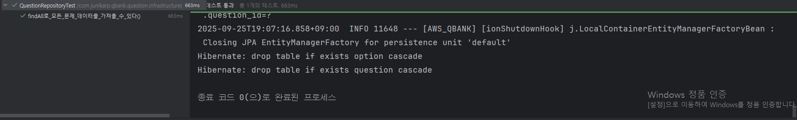

# DataJpaTest 어노테이션에 대해
테스트 코드 작성 중 오류가 발생해 해결 과정을 개략적으로 적어본다.

```java
package com.junikarp.qbank.question.infrastructure;

import com.junikarp.qbank.question.domain.Question;
import com.junikarp.qbank.question.service.port.QuestionRepository;
import org.junit.jupiter.api.Test;
import org.junit.jupiter.api.extension.ExtendWith;
import org.springframework.beans.factory.annotation.Autowired;
import org.springframework.boot.test.autoconfigure.orm.jpa.DataJpaTest;
import org.springframework.boot.test.context.SpringBootTest;
import org.springframework.context.annotation.ComponentScan;
import org.springframework.test.context.TestPropertySource;
import org.springframework.test.context.jdbc.Sql;
import org.springframework.test.context.jdbc.SqlGroup;
import org.springframework.test.context.junit.jupiter.SpringExtension;

import java.util.List;

import static org.assertj.core.api.Assertions.assertThat;

@ExtendWith(SpringExtension.class)
@TestPropertySource("classpath:/test-application.properties")
@SqlGroup({
        @Sql(value = "/sql/question-repository-test-data.sql", executionPhase = Sql.ExecutionPhase.BEFORE_TEST_METHOD),
        @Sql(value = "/sql/all-data-delete.sql", executionPhase = Sql.ExecutionPhase.AFTER_TEST_METHOD)
})
public class QuestionRepositoryTest {

    @Autowired
    QuestionRepository questionRepository;

    @Test
    void findAll로_모든_문제_데이터를_가져올_수_있다() {
        //given
        //when
        List<QuestionEntity> list = questionRepository.findAll();

        //then
        assertThat(list.get(0).getQuestion()).isEqualTo("1번 문제 입니다.");
        assertThat(list.get(0).getOptions().size()).isEqualTo(4);
        assertThat(list.get(0).getOptions().get(2).getIsCorrect()).isTrue();
    }
}
```
아래 코드를 테스트 하면서 문제가 발생했다. 문제의 원인은 QuestionRepository 를 자동으로 주입받으려 했지만 컴포넌트 스캔이 이루어지지 않아 주입이 불가하다는 내용의 오류였다.
해당 코드는 테스트 폴더의 코드였기 때문에 원본코드에서 QuestionRepository 코드를 스캔했어도 Test 모듈에서는 적용이 되지 않아 생기는 문제였다.
문제 해결을 위해 2가지 해결 방법을 고려해야했다.

### 1. @DataJpaTest 어노테이션 활용
해당 어노테이션의 역할은 아래와 같다.
* 메모리 데이터베이스 설정: 인메모리(in-memory) 데이터베이스를 사용하도록 설정
* JPA 관련 빈(Bean) 로드: @Entity와 관련된 엔티티 클래스, JPA Repository, 트랜잭션 매니저, DataSource 등 JPA 테스트에 필요한 최소한의 빈만 로드
* 트랜잭션 관리: 각 테스트 메소드가 실행될 때마다 트랜잭션을 시작하고, 테스트가 끝나면 자동으로 rollBack

단, 해당 방식 사용시 QuestionJpaRepository 를 주입받아 테스트 해야했다.

### 2. @ComponentScan(basePackages = "...") 활용
말 그대로 컴포넌트 스캔을 통해 현재 있는 Test 패키지 이외의 클래스들에 대해서도 컴포넌트 스캔을 진행하는 것이다. 이렇게 하면 QuestionRepository 도 빈으로 등록되어 주입받는 것이 가능해진다.

### 결과
결과적으로는 1번 방식을 사용해서 해결했다.

```java
package com.junikarp.qbank.question.infrastructure;

import com.junikarp.qbank.question.domain.Question;
import com.junikarp.qbank.question.service.port.QuestionRepository;
import org.junit.jupiter.api.Test;
import org.junit.jupiter.api.extension.ExtendWith;
import org.springframework.beans.factory.annotation.Autowired;
import org.springframework.boot.test.autoconfigure.orm.jpa.DataJpaTest;
import org.springframework.boot.test.context.SpringBootTest;
import org.springframework.context.annotation.ComponentScan;
import org.springframework.test.context.TestPropertySource;
import org.springframework.test.context.jdbc.Sql;
import org.springframework.test.context.jdbc.SqlGroup;
import org.springframework.test.context.junit.jupiter.SpringExtension;

import java.util.List;

import static org.assertj.core.api.Assertions.assertThat;

@ExtendWith(SpringExtension.class)
@DataJpaTest
@TestPropertySource("classpath:/test-application.properties")
@SqlGroup({
        @Sql(value = "/sql/question-repository-test-data.sql", executionPhase = Sql.ExecutionPhase.BEFORE_TEST_METHOD),
        @Sql(value = "/sql/all-data-delete.sql", executionPhase = Sql.ExecutionPhase.AFTER_TEST_METHOD)
})
public class QuestionRepositoryTest {

    @Autowired
    QuestionJpaRepository questionRepository;

    @Test
    void findAll로_모든_문제_데이터를_가져올_수_있다() {
        //given
        //when
        List<QuestionEntity> list = questionRepository.findAll();

        //then
        assertThat(list.get(0).getQuestion()).isEqualTo("1번 문제 입니다.");
        assertThat(list.get(0).getOptions().size()).isEqualTo(4);
        assertThat(list.get(0).getOptions().get(2).getIsCorrect()).isTrue();
    }
}
```

테스트의 목적 상 Jpa repository 를 활용하여 DB 와 영속성 객체가 잘 연결되어 데이터를 가져오는 부분이 메인이라고 생각했기 때문에 도메인 엔티티로 변환하는 과정까지 테스트 할 필요는 없다고 판단했다.



결과적으로 무사히 테스트를 마칠 수 있었다.