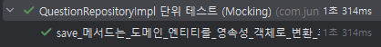

# PotentialStubbingProblem 오류

### 오류 발생
프로젝트를 진행하던 중 테스트 코드를 실행해보다가 다음과 같은 오류가 발생했다.


해당 오류를 살펴보면 원인은 다음과 같다.

`questionJpaRepository.save()` 부분에 `QuestionEntity@47f08b81`가 들어와야 하는데 
실제로 호출된 객체가 `QuestionEntity@614aeccc` 인 것이 문제 상황이었다.

일단 오류를 일으킨 코드 부분을 살펴보면 아래와 같다.

```java
@Mock
private QuestionJpaRepository questionJpaRepository;
@InjectMocks
private QuestionRepositoryImpl questionRepositoryImpl;

@Test
void save_메서드는_도메인_엔티티를_영속성_객체로_변환_후_저장하고_다시_도메인_엔티티로_변환하여_반환한다() {
    // given
    List<Choice> choices = List.of(
            new Choice(1L, "A번", "A번 보기입니다.", false, 1L),
            new Choice(2L, "B번", "B번 보기입니다.", false, 1L),
            new Choice(3L, "C번", "C번 보기입니다.", true, 1L),
            new Choice(4L, "D번", "D번 보기입니다.", false, 1L)
    );
    Question question = Question.builder()
            .id(1L)
            .question("1번 문제입니다")
            .explanation("1번 문제 해설입니다")
            .choices(choices)
            .build();

    QuestionEntity questionEntity = QuestionEntity.from(question);

    // when
    when(questionJpaRepository.save(questionEntity)).thenReturn(questionEntity);
    Question result = questionRepositoryImpl.save(question);

    // then
    assertThat(result.getId()).isEqualTo(1L);
    assertThat(result.getQuestion()).isEqualTo("1번 문제입니다");
    assertThat(result.getExplanation()).isEqualTo("1번 문제 해설입니다");
    assertThat(result.getChoices().size()).isEqualTo(4);
    assertThat(result.getChoices().get(1).getText()).isEqualTo("B번 보기입니다.");

}
```
위와 같이 `QuestionJpaRepository` 부분은 mock 으로 만들고 `QuestionRepositoryImpl` 는 `@InjectMocks` 어노테이션을 활용하여
동작이 가능하도록 만들었다. 이 때 우리가 `save()` 메서드에 매개변수로 사용한 `questionEntity` 부분이 기대한 것과 달랐다는 것이 오류의 내용이었다.


### 원인 분석

문제의 원인을 찾기 위해서 `questionRepositoryImpl` 클래스의 코드를 살펴보자.

```java
@Override
public Question save(Question question) {
    return questionJpaRepository.save(QuestionEntity.from(question)).to();
}
```

위와 같은 코드 모습을 볼 수 있다. 오류는 바로 `QuestionEntity.from(question)` 이 부분 때문에 발생하는 것이었다.
우리가 테스트 코드에서 새로 만든 `questionEntity`가 매개변수로 사용되기를 기대했지만 실제로는 `Question result = questionRepositoryImpl.save(question);`를
통해 들어간 `question` 객체는 `from()`메서드를 통해 새로운 Entity로 탄생하는 것이었다. 

결과적으로 우리가 넣기로 약속했던 `questionEntity` 가 아닌 영속성 객체로 변환된 `question` 객체가 `save()`에 사용되었고, 당연히 다른 값이 들어왔기에 오류가 발생한 것이었다.

### 해결
즉 어떤 객체가 들어가더라도 나오는 값을 고정되도록 만드는 `any()` 를 활용해 테스트를 완성하였다. 아래는 수정 후 전체 코드

```java
package com.junikarp.qbank.question.infrastructure;

import com.junikarp.qbank.choice.domain.Choice;
import com.junikarp.qbank.choice.infrastructure.ChoiceEntity;
import com.junikarp.qbank.question.domain.Question;
import org.junit.jupiter.api.DisplayName;
import org.junit.jupiter.api.Test;
import org.junit.jupiter.api.extension.ExtendWith;
import org.mockito.InjectMocks;
import org.mockito.Mock;
import org.mockito.junit.jupiter.MockitoExtension;

import java.util.ArrayList;
import java.util.List;

import static org.assertj.core.api.Assertions.assertThat;
import static org.mockito.ArgumentMatchers.any;
import static org.mockito.Mockito.verify;
import static org.mockito.Mockito.when;

@ExtendWith(MockitoExtension.class)
class QuestionRepositoryImplTest {

    @Mock
    private QuestionJpaRepository questionJpaRepository;
    @InjectMocks
    private QuestionRepositoryImpl questionRepositoryImpl;

    // 테스트를 위한 ChoiceEntity 객체 생성
    private ChoiceEntity createChoiceEntity(Long id, String number, String text, Boolean isCorrect) {
        ChoiceEntity choice = new ChoiceEntity();
        choice.setId(id);
        choice.setNumber(number);
        choice.setText(text);
        choice.setIsCorrect(isCorrect);
        return choice;
    }

    // 테스트를 위한 QuestionEntity 객체 생성
    private QuestionEntity createQuestionEntity(Long id, String questionText, String explanation, List<ChoiceEntity> choices) {
        QuestionEntity question = new QuestionEntity();
        question.setId(id);
        question.setQuestion(questionText);
        question.setExplanation(explanation);
        question.setChoices(choices);
        choices.forEach(choiceEntity -> choiceEntity.setQuestionEntity(question));
        return question;
    }
    @Test
    void save_메서드는_도메인_엔티티를_영속성_객체로_변환_후_저장하고_다시_도메인_엔티티로_변환하여_반환한다() {
        // given
        List<Choice> choices = List.of(
                new Choice(1L, "A번", "A번 보기입니다.", false, 1L),
                new Choice(2L, "B번", "B번 보기입니다.", false, 1L),
                new Choice(3L, "C번", "C번 보기입니다.", true, 1L),
                new Choice(4L, "D번", "D번 보기입니다.", false, 1L)
        );
        Question question = Question.builder()
                .id(1L)
                .question("1번 문제입니다")
                .explanation("1번 문제 해설입니다")
                .choices(choices)
                .build();

        QuestionEntity questionEntity = QuestionEntity.from(question);

        // when
        when(questionJpaRepository.save(any(QuestionEntity.class))).thenReturn(questionEntity);
        Question result = questionRepositoryImpl.save(question);

        // then
        assertThat(result.getId()).isEqualTo(1L);
        assertThat(result.getQuestion()).isEqualTo("1번 문제입니다");
        assertThat(result.getExplanation()).isEqualTo("1번 문제 해설입니다");
        assertThat(result.getChoices().size()).isEqualTo(4);
        assertThat(result.getChoices().get(1).getText()).isEqualTo("B번 보기입니다.");

        verify(questionJpaRepository).save(any(QuestionEntity.class));

    }
}
```

수정 후 무사히 테스트 완료 된 모습을 확인할 수 있었다.




