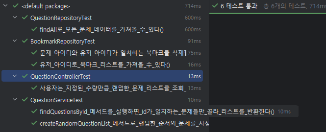

# 랜덤 메서드 테스트 해보기 (진행 중)

> 랜덤으로 값이 생성되는 부분에 대한 테스트 코드를 작성하는 과정을 기록한 문서입니다.

### 초기 코드 작성

> 프로젝트 진행 중 문제은행에서 문제를 랜덤으로 섞어서 사용자에게 제공하는 기능을 개발하는 데 `Collections.shuffle()` 메서드를 활용하였습니다.

```java

@Override
public List<Question> createRandomQuestionList(int Quantity) {

    List<Question> wholeQuestionList = questionRepository.findAll();

    Collections.shuffle(wholeQuestionList);

    return wholeQuestionList.stream()
            .limit(Quantity)
            .toList();

}
```

주어진 `Quantity` 만큼 랜덤으로 문제를 제공하기 위해서 위와 같이 코드를 작성하였습니다.
하지만 테스트를 진행함에 있어서 랜덤한 값을 테스트하는데 어떻게 코드를 구성할 지 고민해야했습니다.

```java

@Test
void 사용자는_지정된_수량만큼_랜덤한_문제_리스트를_조회_할_수_있다() {
    //given
    TestContainer testContainer = TestContainer.builder()
            .build();

    testContainer.questionRepository.save(initQuestionList.get(0));
    testContainer.questionRepository.save(initQuestionList.get(1));
    testContainer.questionRepository.save(initQuestionList.get(2));

    int randomCount = 0;

    //when
    ResponseEntity<RandomQuestionListResponse> result = testContainer.questionController.getRandomQuestionList(2);

    for (int i = 0; i < 10; i++) {
        assertThat(result.getStatusCode()).isEqualTo(HttpStatusCode.valueOf(200));
        assertThat(result.getBody()).isNotNull();
        assertThat(result.getBody().getList().size()).isEqualTo(2);

        if (result.getBody().getList().get(0).getId() != 1) {
            randomCount++;
        }
    }

    //then
    assertThat(randomCount).isGreaterThan(1);
}
```

초기 코드입니다. 위 코드는 두 개의 문제 리스트를 비교하는 테스트를 총 10회 반복해서 수행합니다. 비교하는 리스트는 각각 **기존 문제 리스트**와 **랜덤 문제 리스트**입니다.

테스트는 10회 반복되며, 그 과정에서 다음 조건에 따라 randomCount라는 변수의 값이 증가합니다.

randomCount 증가 조건: 기존 문제 리스트의 첫 번째 문제 ID와 랜덤 문제 리스트의 첫 번째 문제 ID가 다를 경우 randomCount가 1씩 증가합니다.

모든 테스트(10회)가 끝난 후, randomCount의 최종 값이 2 이상이면 테스트를 통과한 것으로 간주합니다.

### 불필요한 로직의 제거

```java

@RepeatedTest(value = 5)
void 사용자는_지정된_수량만큼_랜덤한_문제_리스트를_조회_할_수_있다() {
    //given
    TestContainer testContainer = TestContainer.builder()
            .build();

    testContainer.questionRepository.save(initQuestionList.get(0));
    testContainer.questionRepository.save(initQuestionList.get(1));
    testContainer.questionRepository.save(initQuestionList.get(2));

    //when
    ResponseEntity<RandomQuestionListResponse> result = testContainer.questionController.getRandomQuestionList(2);

    //then
    assertThat(result.getStatusCode()).isEqualTo(HttpStatusCode.valueOf(200));
    assertThat(result.getBody()).isNotNull();
    assertThat(result.getBody().getList().size()).isEqualTo(2);
    assertThat(result.getBody().getList().get(0).getId()).isNotEqualTo(1);
}
```

for 문과 같은 논리적인 로직이 테스트에 영향을 줄 수 있기 때문에 for 문을 삭제하였습니다. 대신 `@RepeatedTest`를 활용하여 테스트를 여러번 진행하도록 개선하였습니다.

하지만 위 코드에서는 기존 문제 리스트의 첫 번째 문제 ID와 랜덤 문제 리스트의 첫 번째 문제 ID를 비교하는 코드가 실패할 가능성이 존재합니다. (랜덤으로 섞었어도 첫 문제가 같을 수 있기 때문)

결과적으로 다른 테스트 방식을 고민해야 했습니다.

### 랜덤 값 고정

여러 정보들을 찾아보면서 `Collections.shuffle()` 메서드를 테스트 하는 것은 의미가 없다는 것을 깨닫게 되었습니다. 이러한 메서드는 자바 라이브러리에서 제공하기 때문에 제어할 수 있는 부분이 아니기
때문입니다.

때문에 랜덤한 값에 초점을 두기보다는 구현한 비즈니스 로직이 정상적으로 작동하는 지에 테스트 목적을 변경하는 방향으로 테스트를 진행해야겠다고 판단했습니다.

그래서 우선적으로 QuestionShuffler 라는 인터페이스와 구현체를 통해 문제를 섞는 부분을 별개의 클래스로 분리했습니다.

```java

@Component
public class QuestionShufflerImpl implements QuestionShuffler {

    @Override
    public List<Question> shuffle(List<Question> questionList) {
        Collections.shuffle(questionList);
        return questionList;
    }

}
```

기능 분리 이후에 테스트를 위한 mock 객체를 생성한 후 입력으로 들어온 테스트 값을 그대로 다시 반환하도록 설정했습니다.

```java
import java.util.List;

public class QuestionShufflerTest implements QuestionShuffler {

    @Override
    public List<Question> shuffle(List<Question> questionList) {
        return questionList;
    }
}
```

최종적으로 테스트 컨테이너에서 `QuestionShuffler`를 주입해주고 테스트 코드 수정 후에 성공적으로 테스트를 마무리 할 수 있었습니다.

```java
public class TestContainer {

    public final QuestionRepository questionRepository;
    public final QuestionService questionService;
    public final QuestionController questionController;
    public final QuestionShuffler questionShuffler; // 분리한 인터페이스 활용

    @Builder
    public TestContainer() {
        this.questionShuffler = new QuestionShufflerTest();
        this.questionRepository = new FakeQuestionRepository();
        this.questionService = QuestionServiceImpl.builder()
                .questionRepository(this.questionRepository)
                .questionShuffler(this.questionShuffler)
                .build();
        this.questionController = QuestionController.builder()
                .questionService(this.questionService)
                .build();
    }
}
```

```java
// 컨트롤러 테스트 코드 부분
@Test
void 사용자는_지정된_수량만큼_랜덤한_문제_리스트를_조회_할_수_있다() {
    //given
    TestContainer testContainer = TestContainer.builder()
            .build();

    testContainer.questionRepository.save(initQuestionList.get(0));
    testContainer.questionRepository.save(initQuestionList.get(1));
    testContainer.questionRepository.save(initQuestionList.get(2));

    //when
    ResponseEntity<RandomQuestionListResponse> result = testContainer.questionController.getRandomQuestionList(2);

    //then
    assertThat(result.getBody()).isNotNull();
    assertThat(result.getBody().getList().size()).isEqualTo(2);
    assertThat(result.getBody().getList().get(0).getId()).isEqualTo(1);
}
```

```java
// 서비스 레이어 테스트 코드 부분
@Test
void createRandomQuestionList_메서드로_랜덤한_순서의_문제를_지정된_수량만큼_리스트로_반환한다() {
    //given
    int quantity = 2;

    //when
    List<Question> randomQuestionList = questionService.createRandomQuestionList(quantity);

    //then
    assertThat(randomQuestionList.size()).isEqualTo(quantity);
    assertThat(initQuestionList).containsAll(randomQuestionList);
    assertThat(randomQuestionList).isNotEqualTo(initQuestionList); // 아주 가끔 실패 뜰 수도 있음
}
```



수정 후 무사히 테스트를 성공할 수 있었습니다.

